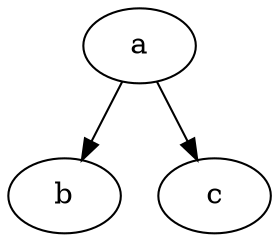

# 前言

經由[電腦玩物](https://www.playpcesor.com/?m=0)得知Evernote後，我使用它也有6年的時間了，記事的數量超過2500則，也在2年前訂購了專業版。每天上課做筆記、回家寫作業、上網找資料和規劃做專案都少不了Evernote，我可以説是滿重度的使用者了，沒有它我很多事沒辦法做。

但是就在這幾年我開始接觸「開源」和「自由檔案」，我就漸漸脫離商業軟體的束縛，改為使用開源的軟體，像是文書辦公軟體LibreOffice、簡單影片剪輯Shotcut和文字編輯器ATOM。但Evernote我一直找不到好的軟體來取代它，但筆記軟體對我來説又是這麽的重要，所以在尋尋覓覓下，終於找到了今天的主角——[VNote](https://tamlok.github.io/vnote/zh_cn/#!index.md)。

<!--more-->

# VNote簡介

1.  使用Markdown語法
2.  在編輯模式下原地預覽圖片、圖表和公式
3.  分類方式有筆記本、無限層級的資料夾和標簽
4.  可以直接貼上圖片
5.  模糊搜尋
6.  MIT開源協議
7.  由Qt和C++建構而成
8.  Windows、macOS和Linux都有
9.  高度可制定的外觀樣式(畢竟是開源的
10.  UML圖表、流程圖、時序圖和數學公式。支援語法：Mermaid、 Flowchart.js、 MathJax、 WaveDrom、PlantUML 和 Graphviz
11.  更詳細介紹請見[網站](https://tamlok.github.io/vnote/zh_cn/#!index.md)和[GitHub](https://github.com/tamlok/vnote)

# 什麽是Markdown ?

Markdown是一種自由格式的輕量級標示語言(Lightweight Markup Language)，還可以很輕鬆的和HTML互相轉換。

我在找尋替代的筆記軟體時就是以支援Markdown的軟體為最優先的，因爲我想替換掉Evernote的根本原因就是不想被單一廠商束縛，所以最底層的檔案格式當然也是要用自由檔案格式。之後GitHub常見的Markdown格式就被我優先考慮了。

至於Markdown的用法和教學可以參考此網頁：[Markdown 基本语法](https://github.com/younghz/Markdown)
另外介紹一個國產的超優質Markdown線上筆記網站：[HackMD](https://hackmd.io/)


#  界面導覽


這是VNote的基本界面。以下先簡單的介紹各個區域：(因爲這些區塊都是可以任意移動位置的，所以我以預設為例)

*   中間是筆記編輯/預覽區：就是用來打筆記的地方。
*   上方是功能區：像是新筆記、儲存、預覽、加表格或加附件等相關功能都在這裡。
*   左方是分類區：
    *   筆記本：列出筆記本和資料夾，在下方會列出各自的筆記，以方便開啓。
    *   歷史：顯示瀏覽筆記的歷史記錄。
    *   瀏覽器：就是檔案總管。
    *   標簽：列出標簽，在下方會列出各自的筆記，以方便開啓。
*   右上是工具：
    *   大綱：以筆記的標題自動列出大綱，點擊各標題可以跳至標題處。
    *   片段：可以加入一些自己常用的詞，以快速打進筆記。
    *   小推車：應該是類似快速集合的地方。
*   右下是搜尋：可以用來搜尋筆記、筆記本、内文...等等。
*   下方是標簽和字數統計：編輯標簽和顯示字數統計。


#  重點功能

## 加入圖片

Markdown是純文字的檔案，它不像.doc、.odt之類的文件檔案可以直接插入圖片。但作爲一個筆記軟體，圖片要如何加入是非常重要的。

VNote除了用網址的方式加入圖片外還支援直接按“Ctrl + V”貼上圖片，他會自動將圖片存到筆記本内的特定資料夾中(預設為*v*images)，只要將整個記事本都傳上雲端，就可以實現多裝置同步查看/編輯筆記了，這也是我在眾多Markdown軟體中選擇VNote的重要原因。

而且VNote的圖片支援編輯時及時原地預覽功能。


## 智慧表格

剛開始用Markdown語法時可能會覺得它的表格不是很好打，會弄得很亂，但VNote的表格會自動依照内容長度進行調整，相當方便。


#  更多功能

## MathJax

MathJax是一個JavaScript庫，可以利用LaTeX、MathML 或AsciiMath的語法來編寫數學算式。而且VNote支援編輯時及時原地預覽功能，讓更加編寫方便。

詳細用法請看：[MathJax](https://www.mathjax.org/)。要將上方工具列 > Markdown > 擴展 > MathJax 勾選起來並重新打開檔案才能使用此功能。

範例：

```LaTeX
$$

V\_N ({1 \\over Z\_0} + {3 \\over Z\_\\phi}) = {{V\_{a'n}+V\_{b'n}+V\_{c'n}} \\over Z\_\\phi} \\qquad \\color{#08A}{(11.6)}

$$
```


## Flowchart.js

Flowchart.js可以用來繪製流程圖，VNote支援編輯時及時原地預覽功能。

詳細用法請看：[Flowchart.js](https://flowchart.js.org/)。要將上方工具列 > Markdown > 擴展 > Flowchart.js 勾選起來並重新打開檔案才能使用此功能。

範例：

```flowchart
st=>start: Start:>http://www.google.com[blank]
e=>end:>http://www.google.com
op1=>operation: My Operation
sub1=>subroutine: My Subroutine
cond=>condition: Yes
or No?:>http://www.google.com
io=>inputoutput: catch something...

st->op1->cond
cond(yes)->io->e
cond(no)->sub1(right)->op1
```


## PlantUML

PlantUML可以用來繪製各種圖表，VNote支援編輯時及時原地預覽功能。

詳細用法請看：[PlantUML](http://plantuml.com/)。要在設定中啓用PlantUML才能使用此功能。

範例：

```puml
Alice -> Bob: Authentication Request
Bob --> Alice: Authentication Response

Alice -> Bob: Another authentication Request
Alice <-- Bob: another authentication Response
```


## Graphviz

Graphviz可以用來文字來描述各個節點的關係，并且圖形化，VNote支援編輯時及時原地預覽功能。

詳細用法請看：[Graphviz](https://www.graphviz.org/about/)。要在設定中啓用Graphviz，并且下載Graphviz，將dot.exe的路徑在設定中的「Graphviz可執行文件」欄位中貼上才能使用此功能。

範例：




## Mermaid

Mermaid可以讓你用簡單的語法繪製圖表。不過目前不支援編輯時及時原地預覽功能，要右鍵開啓「圖表實時預覽」畫面。

詳細用法請看：[Mermaid](https://mermaidjs.github.io/)。要將上方工具列 > Markdown > 擴展 > Mermaid 勾選起來並重新打開檔案才能使用此功能。

範例：


## WaveDrom

WaveDrom是一個基於JavaScript的時序圖編寫語法，對於電機電子相關領域的人來説有這個功能很方便。目前不支援編輯時及時原地預覽功能，要右鍵開啓「圖表實時預覽」畫面。

詳細用法請看：[WaveDrom](https://wavedrom.com/)。要將上方工具列 > Markdown > 擴展 > WaveDrom 勾選起來並重新打開檔案才能使用此功能。

範例：

```wavedrom
{signal:[
  {name: '/EA',    wave: '0......'},
  {name: 'ALE',    wave: '010..1.'},
  {name: '/PSEN',  wave: '01.0.1.'},
  {name: 'Port-0', wave: 'x2.x3.x' , data: ['輸出低位置', '輸入指令']},
  {name: 'Port-2', wave: 'x4....x' , data: ['輸出高位置']},
]}
```


#  結論

VNote的功能非常多，如過在使用上有任何問題，都可以向打開上方工具列 >幫助(H) > Markdown指南(M) 來查看官方的教學文件。

本文章使用之VNote為2.3版。
